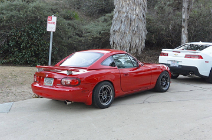
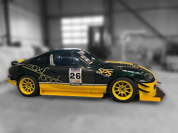
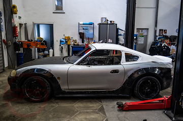

# Mazda MX-5 NB - Mods List

<!-- @import "[TOC]" {cmd="toc" depthFrom=1 depthTo=6 orderedList=false} -->

<!-- code_chunk_output -->

- [Mazda MX-5 NB - Mods List](#mazda-mx-5-nb-mods-list)
    - [Exterieur](#exterieur)
      - [Hardtops](#hardtops)
      - [Spoiler/Wings](#spoilerwings)

<!-- /code_chunk_output -->

### Exterieur

#### Hardtops

**Rechtliches:** Ein Hardtop braucht keine Zulassung, da es Beladung zählt. Es muss lediglich ordnungsgemäß befestigt werden und als Beladung zulässig sein (z.B. Maße).

* **Garage Vary (Fastback)** [[REV9Autosport (Nicht auf Lager)](https://rev9autosport.com/nb/garage-vary-nb-hardtop-fastback.html), [Garage Vary](https://vary.co.jp/?pid=101546285), [Garage Vary (Google Übersetzer)](https://vary-co-jp.translate.goog/?pid=101546285&_x_tr_sl=ja&_x_tr_tl=en&_x_tr_hl=de&_x_tr_pto=wapphttps:/)]
  *Scheinbar sehr schwer zu kriegen. UPDATE: Verfügbar bei Hersteller selber aus Japan. Lieferung leider nur bis an Flughafen und nicht weiter. Internationaler Versand ungewiss. Zoll wird Probleme machen. Evtl. Garage Vary bevor Kauf kontaktieren via E-Mail oder Tel.*
  
* **SPS Motorsport (Fastback)** [[SPS Motorsport](https://sps-motorsportshop.com/teileshop/performance-teileshop/mazda-mx-5-nb-1999-2000/exterieur/dach/3158/fastback-hardtop-mx-5-nb/nbfl)]
  *Zulassung ungewiss, da sehr lange. Mail bereits an SPS Motorsport gesendet, warte auf Antwort. Ungewiss ob der Kofferraum erreichbar ist und unwahrscheinlich das Spoiler montiert werden können, außer Ducktail.*
   

#### Spoiler/Wings

**TODO:** Rechtliche Situation hier eintragen.

* **CarbonMiata RS-Type GT Wing** [[CarbonMiata](https://www.carbonmiata.com/shop/mazda-mx-5/nb-99-05-mazda-mx-5/exterior-parts-nb-99-05-mazda-mx-5-nb-99-05-mazda-mx-5/trunk-spoiler/rs-type-gt-wing-for-miata-na-mk1-nb-mk2/)]
  *Erhältlich in Forged Carbon Fiber, Carbon Fiber & Fiberglass.
  Befestigung per 3M Tape oder per Anschrauben.
  Kofferraum zugänglich*.
   
